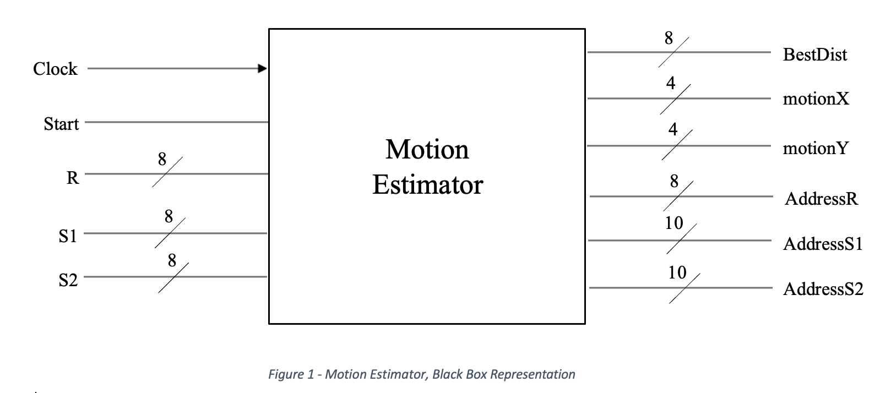
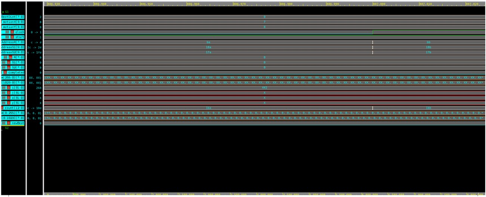
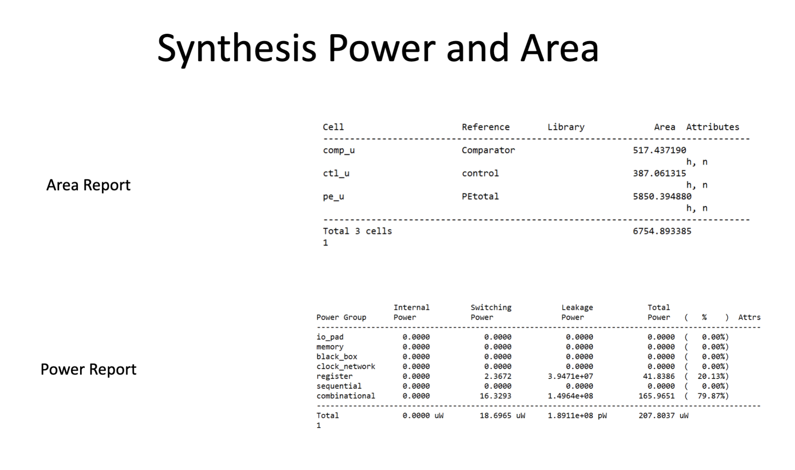
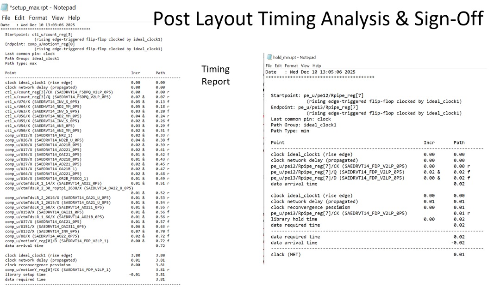
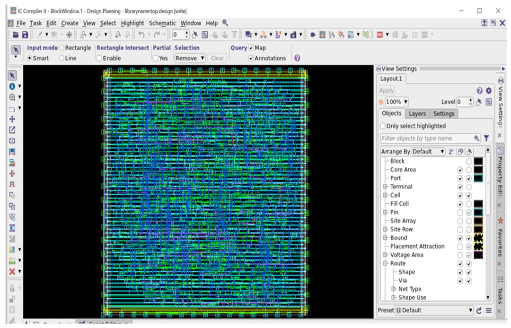

# RTL-to-GDSII ASIC Motion Estimator in 32/28nm CMOS

Oscar Barajas  
M.S. Electrical & Computer Engineering — San Francisco State University  

---

## 📌 Overview

This project implements a **hardware motion estimator for video compression** using a block-matching algorithm. The design computes motion vectors between video frames using a 16×16 reference block within a 31×31 search window, enabling real-time frame-to-frame compression at a target frequency of **260 MHz**.

A complete RTL-to-GDSII ASIC flow was executed using industry-standard Synopsys tools, including functional verification, synthesis, physical implementation, parasitic extraction, and timing sign-off.

---

## 🎯 Project Objectives

- Design a high-performance hardware motion estimator
- Implement full ASIC design flow in 32/28 nm CMOS
- Meet real-time timing constraints (3.8 ns clock period)
- Achieve timing closure with verified setup and hold margins
- Demonstrate professional sign-off methodology

---

## 🏗 System Architecture

- Reference Block: 16 × 16 grayscale pixels  
- Search Window: 31 × 31 pixels  
- Algorithm: Block Matching  
- Processing: Parallel Processing Elements (PEs)  
- Output: Motion Vectors (X, Y)  
- Distortion Metric: Saturating Absolute Difference  

Main modules:
- Processing Elements (PEs)
- Comparator
- Control FSM
- Top-Level Integration

---

## 🧪 Verification

### Simulation

- Tool: Synopsys VCS
- File-driven testbench using `$readmemh`
- Image-based verification methodology

### Test Scenarios

- Worst-case (no match)
- Partial match
- Perfect match

Verification confirmed correct distortion calculation and motion vector selection.

---

## 🔧 RTL Development

- Language: Verilog HDL
- Modular and parameterized design
- Synchronous, clocked architecture
- Fully synthesizable coding style

Source files are located in the `RTL/` directory.

---

## ⚙️ Logic Synthesis

- Tool: Synopsys Design Compiler
- Target Frequency: 260 MHz
- Clock Period: 3.8 ns
- Constraints: SDC-based timing constraints

### Outputs

- Gate-level netlist
- Area reports
- Power reports
- QoR reports

---

## ⏱ Static Timing Analysis (Pre-Layout)

- Tool: Synopsys PrimeTime
- Netlist + SDC
- Setup and hold verification
- Critical path analysis

Pre-layout STA confirmed timing feasibility prior to physical design.

---

## 🏭 Physical Design

- Tool: Synopsys ICC2
- Technology: 32/28 nm CMOS

### Flow

1. Floorplanning
2. Placement
3. Clock Tree Synthesis (CTS)
4. Routing
5. Optimization

### Outputs

- GDSII layout
- Post-layout netlist
- Updated SDC
- DEF/LEF views

---

## 🔍 Parasitic Extraction

- RC parasitics extracted after routing
- Generated SPEF files
- Used for post-layout analysis

Accurate parasitic modeling enabled reliable sign-off analysis.

---

## ✅ Timing Sign-Off (Post-Layout)

- Tool: Synopsys PrimeTime
- Inputs:
  - Post-layout netlist
  - SPEF parasitics
  - Updated constraints

### Analysis Corners

- MAX Corner → Setup analysis
- MIN Corner → Hold analysis

Final reports confirmed full timing closure.

---

## 📊 Results Summary

| Metric         | Value        |
|----------------|--------------|
| Technology     | 32/28 nm CMOS |
| Frequency      | 260 MHz       |
| Clock Period   | 3.8 ns        |
| Timing Status  | Closed        |
| Flow           | RTL → GDSII   |

The design achieved stable operation across all process corners with verified functional correctness.

---

## 🛠 Tools Used

| Stage              | Tool                    |
|--------------------|--------------------------|
| RTL & Simulation   | Synopsys VCS             |
| Synthesis          | Synopsys Design Compiler |
| Physical Design    | Synopsys ICC2            |
| STA & Sign-Off     | Synopsys PrimeTime       |
| Parasitics         | SPEF                     |

---

## 📁 Repository Structure

